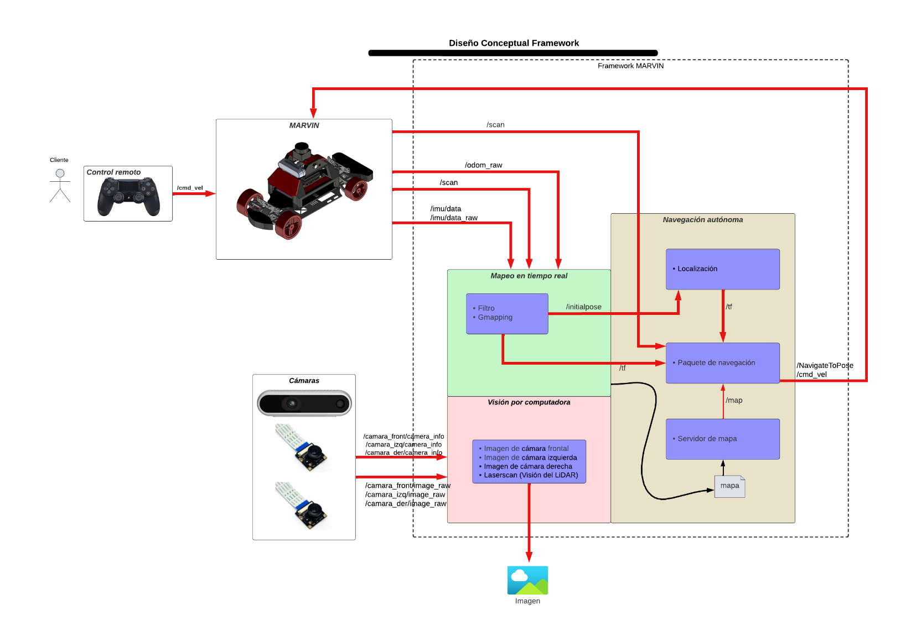

# Mobile Autonomous Robot Vehicle for Investigation and Navigation

## Introduction
MARVIN is a comprehensive platform (built by Luis Andrade Proaño) designed to facilitate the development and deployment of autnomous vehicles with Ackermann steering , providing a set of essential modules and tools to enable various capabilities. The framework consists of the following core components:
- Manual control over the vehicle.
- Real time mapping of the enviroment sourrounding the robot.
- Localization, once the map is saved in the robots system. 
- Autonomous navigation of the vehicle with object avoidance.
- Simulation enviroment designed for gazebo.
- Graphical User Interface (GUI).
- Code developed for ROS2 foxy

MARVIN is designed to be versatile, enabling researchers and developers to experiment with different robot types with the same steering system, test various algorithms, and to navigate complex enviroments  in real-world scenarios. By providing these core modules and simulation environments, MARVIN is another tool for investigation in the field of robotics.

## Framework Overview
An overview of the framework modules and communications is presented below:


# Software Requirements 
For the simulation :
- Operating System: Ubuntu Linux Jammy Jellyfish LTS (22.04.3) - https://releases.ubuntu.com/jammy/

For MARVIN :
- Operating System: Jetson Nano Developer Kit SD Card Image (Ubuntu Linux Bionic Beaver 18.04 ) - https://developer.nvidia.com/embedded/learn/get-started-jetson-nano-devkit#write
- For the simulation consider according the computational requirements .


<details open>
  <summary> <b> Prerequisites <b></summary>
  0.1.- Update your apt repository
    
  ```sh
  sudo apt update
  ```
  0.2.- Download and install git 
  ```sh
  sudo apt install git
  ```
  * To confirm that it's properly installed, run the following command 
    ```sh
    git --version
    ```
  0.3.- Download and install ROS2 humble 
  
  All instructions are found in the following link: https://docs.ros.org/en/humble/Installation/Ubuntu-Install-Debians.html 
  
  * Finally add sourcing to your shell startup script
    ```sh
    echo "source /opt/ros/humble/setup.bash" >> ~/.bashrc
    ```
  0.4.- Install Gazebo for simulation with physics
  ```sh
  sudo apt install ros-humble-gazebo-ros-pkgs
  ```
  0.5 Install the following dependencies
    ```sh
    sudo apt install ros-humble-xacro
    sudo apt install ros-humble-joint-state-publisher
    sudo apt install ros-humble-joint-state-publisher-gui
    sudo apt install python3-colcon-common-extensions
    sudo apt install ros-humble-ros2-control
    sudo apt install ros-humble-navigation2 ros-humble-nav2-bringup
    sudo apt install ros-humble-twist-mux
    ```
</details>

<!---## Dependencies:
For the simulation:
- ROS2 Foxy. Installation: https://docs.ros.org/en/foxy/Installation/Ubuntu-Install-Debians.html 
- Verify gazebo installation. 
- Verify the acquisition of the gazebo controls library. If it is not installed:
```sh
sudo apt-get install ros-foxy-gazebo-ros2-control
```
-->

# Installation steps for the simulation

1.- Clone the github repository in a workspace source folder. (marvin_sim_ws/src)
```sh
git clone https://github.com/RAMEL-ESPOL/MARVIN.git
```
2.- Go to workspace directory and copy the "meshes" folder
```sh
cd MARVIN/marvin_sim_ws/src/marvin_description
```
* Paste the "meshes" folder into the following folder. (This will allow you to visualize the MARVIN model in the Gazebo environment)
  ```sh
  cd .gazebo
  mkdir models
  cd models
  mkdir marvin_model
  ```
3.- Build the package in marvin_sim_ws workspace.
```sh
colcon build
```
## Process
0.- Navigate to the workspace directory (The previous step to perform in all new cmd windows opened)
```sh
source install/setup.bash
```
1.- Launch the simulation.
```sh
ros2 launch marvin_sim_gazebo gazebo_spawn.launch.py world:=./src/marvin_sim_gazebo/worlds/obstacles.world use_sim_time:=true
```
2.- Open a new cmd window, source in the ws and launch SLAM.
```sh
ros2 launch marvin_navigation slam.launch.py use_sim_time:=true
```
In Rviz activate the map node and spec

3.- Connect a joystick to the computer and use it to move the vehicle manually around the map. 

After you've mapped the area, go in Rviz to Panels -> add new Panel and click on SlamToolboxPlugin
Make sure that you save the map with the name "marvin_world"

4.- After saving, finish with Ctrl-c the window where is you where running SLAM and in Rviz don't forget to Remove the Map plugin

5.- Open a new cmd window, source in the ws and launch the Navigation.
```sh
ros2 launch marvin_navigation navigation.launch.py use_sim_time:=true
```
To make the robot navigate autonomously use the 2D Goal Pose tool in Rviz to select a point in the map.

You can now move the robot freely through the map. You can also (during the path) use manual control to change directions, but the robot will stop at the Goal that you previously set.


## Installation for the Jetson Nano
1.- Clone the github repository in the HOME enviroment.
```sh
git clone https://github.com/RAMEL-ESPOL/MARVIN.git
```
2.- Go to recently downloaded folder and initialize the DockerFile (dont worry, the factory image of the Jetson Nano comes with Docker pre-installed).
```sh
cd /MARVIN
sudo docker build . -t marvin:latest
```
After the docker has been built, you have to run it with the following conditions
3.- Build the pacakge.
```sh
docker run -it --net=host --device=/dev/input/event3 --device=/dev/input/js0 --device=/dev/myserial --device=/dev/rplidar --env="DISPLAY" --env="QT_X11_NO_MITSHM=1" -v /tmp/.X11-unix:/tmp/.X11-unix marvin:latest /bin/bash
```
This will let you run the Docker and create a container to work in. 

Exit the docker with the "exit" command. 
Now that the container is created, all the files and changes that you've made, will remain there.
To open the container you must first now its name. 
Get it with: 
```sh
docker ps -a
```
The last name is the last container that was active. 
4.- Start the container
```sh
docker start <container name> 
```
5.- Run the container
```sh
docker exec -it <container name> /bin/bash
```

##Quality of life improvements 
For an easier time running the Jetson nano, first enable remote control (the following video gives the proper instrucions): 

```sh
https://www.youtube.com/watch?v=Rgmw6kPmhXI
```
After enabling the Jetson Nano for remote control, download from the main page "RealVNC Viewer"

Everytime you open a new cmd window, you must execute the running container to acces it
```sh
docker exec -it <container name> /bin/bash
```

## Process
0. Inside the container you'll be in the MARVIN workspace already built. (Important step to perform in all new cmd windows opened)
```sh
source install/setup.bash
```
1. Launch the control and LiDAR of the robot
```sh
ros2 launch marvincar_bringup marvincar_bringup.launch.py
```

2. Open a new cmd window, source in the ws and launch the LiDAR.
```sh
ros2 launch marvin_lidar ld19.launch.py
```
In Rviz activate the map node and spec

3. Open a new cmd window, source in the ws and launch Rviz
```sh
ros2 launch marvincar_nav view_map_launch.py 
```
4. Start the mapping node
```sh
ros2 launch marvincar_nav mapping_launch.py  
```
Move the vehicle so that SLAM Toolbox maps the area in real time. 

After you've mapped the area. 

5. After you've mapped the area, go in Rviz to Panels -> add new Panel and click on SlamToolboxPlugin Make sure that you save the map with the name "marvincar"

6. Close the Map Plugin and the cmd Windows that's running the mapping 

7. Launch the Navigation.

```sh
ros2 launch marvincar_nav navigation_dwa_launch.py
```
To make the robot navigate autonomously use the 2D Pose Estimate to select the point in the map where the real robot is, drag the click to specify its orientation.
Use the 2D Goal Pose tool in Rviz to select a point in the map.

You can now move the robot freely through the map.

=======

## Package Structure
The package structure is the following:
- **marvin_images ->** includes images of the project.
- **marvin_ws ->** includes the robots' packages (In this repo are all the packages that control the vehicule including the LiDAR LD19 sensor).
- **marvin_sim_ws ->** includes the robots' simulation packages (In this repo are all the packages that control the vehicule including the different Gazebo enviroments ready for usage).
- **configurations ->** contains the bash file that replaces the original created in the Docker container.
- **Dockerfile ->** contains a list of instrucctions to build a container from a file. (Includes the main container image with ubuntu 20.04 and ROS2 foxy installed).


